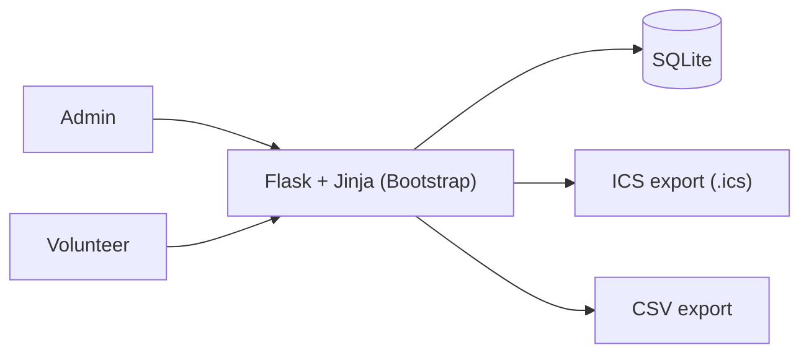
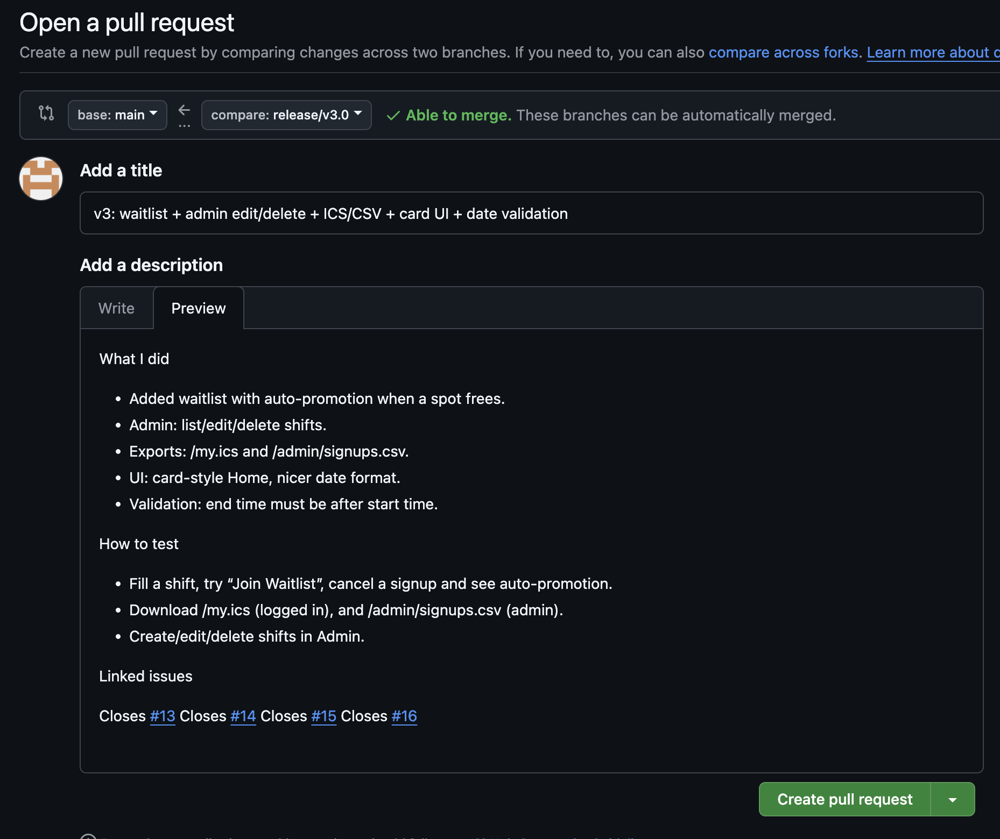
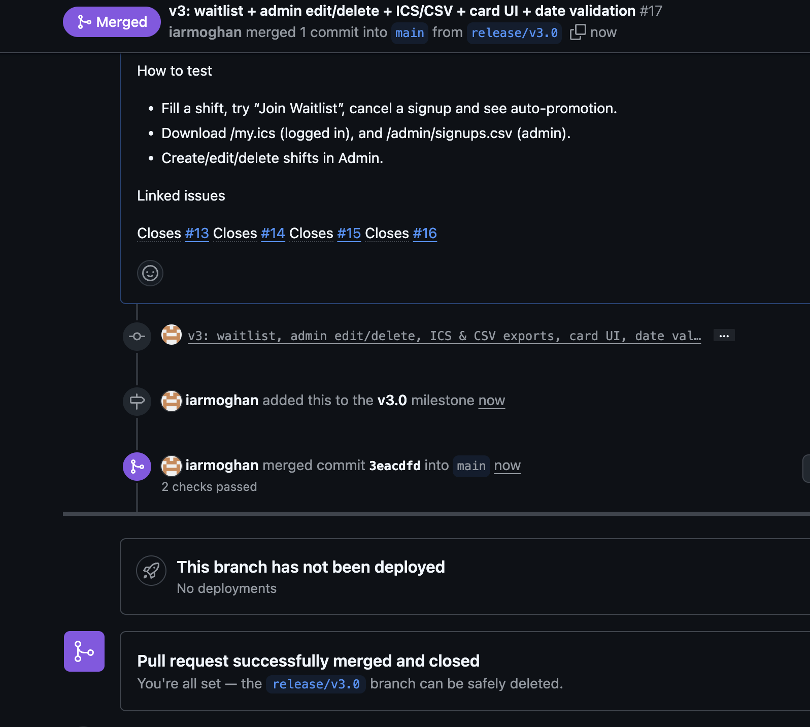
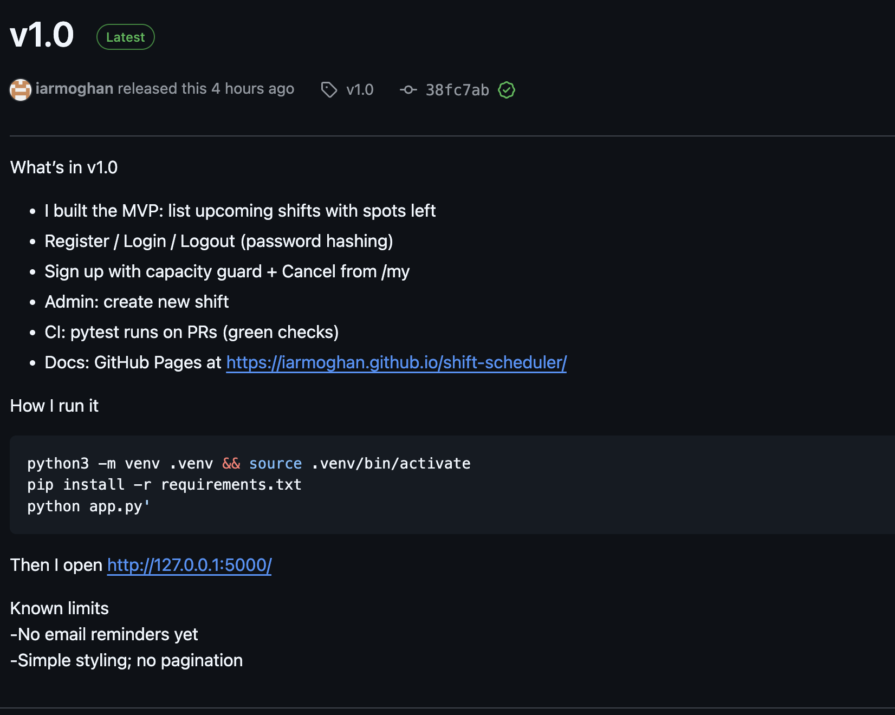
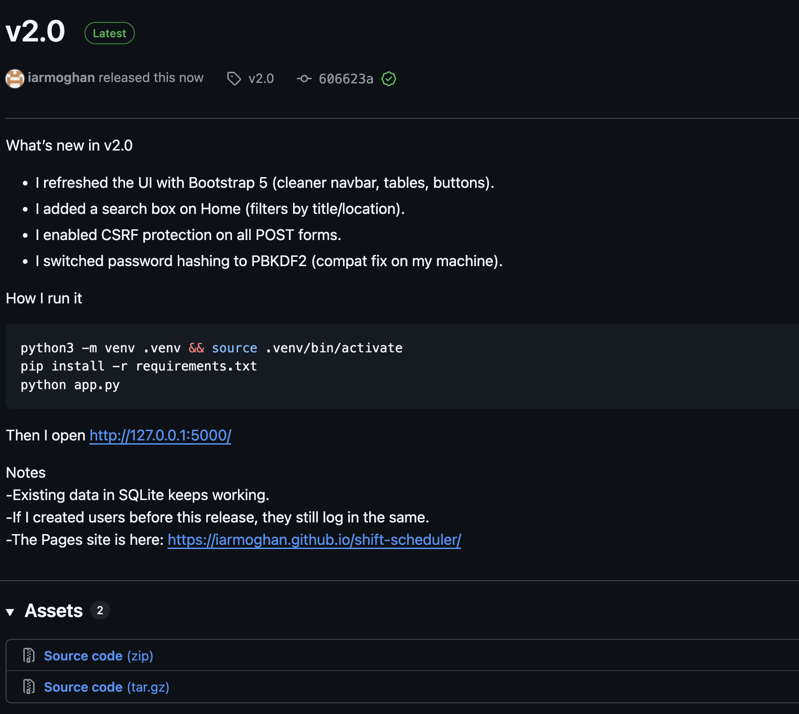
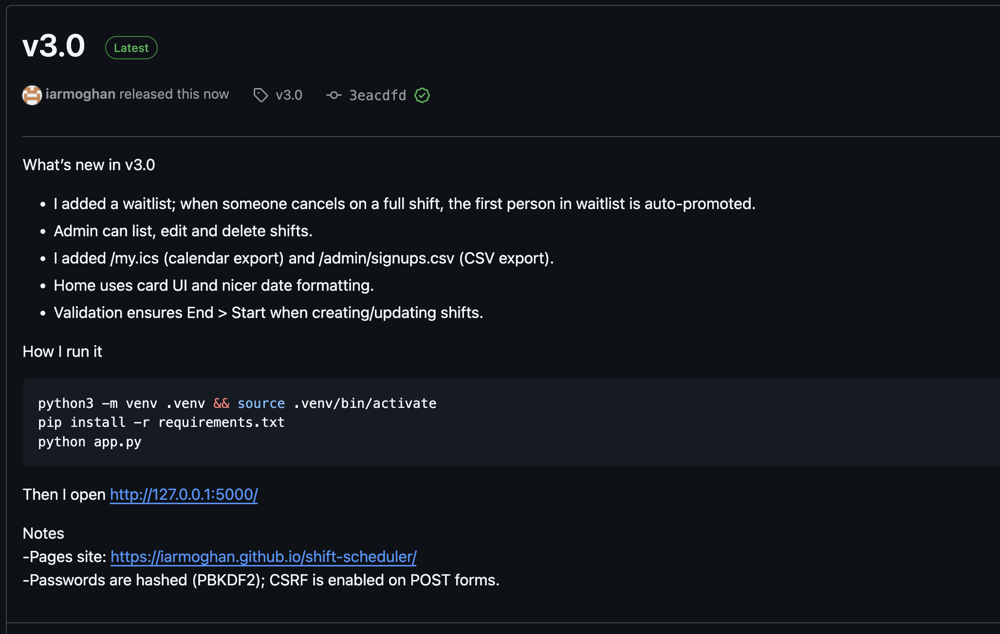

# Volunteer Shift Scheduler

I built a lightweight volunteer shift scheduler to make sign-ups easy. Admins create shifts with titles, times, locations, and capacity. Volunteers can browse and search upcoming shifts, sign up, cancel, and if a shift is full—join a waitlist that auto-promotes when someone drops out. The app includes a clean Bootstrap UI, secure auth (PBKDF2 + CSRF), and exports: volunteers can download their shifts as an .ics calendar file and admins can export signups as CSV.


---

## Summary (what this does)
I built a lightweight volunteer shift scheduler to make sign-ups easy. Admins create shifts with titles, times, locations, and capacity. Volunteers can browse and search upcoming shifts, sign up, cancel, and—if a shift is full—join a waitlist that auto-promotes when someone drops out. The app has a clean Bootstrap UI, secure auth (PBKDF2 + CSRF), and exports: volunteers can download their shifts as an **.ics** calendar file and admins can export signups as **CSV**.

---

## Demo & How I run it

```bash
python3 -m venv .venv && source .venv/bin/activate   # Windows: .venv\Scripts\Activate.ps1
pip install -r requirements.txt
python app.py
```

Then I open **http://127.0.0.1:5000**

**Admin for local dev:** `admin@example.com` / `admin123`

Project site (Pages): **https://iarmoghan.github.io/shift-scheduler/**

---

## Core features (v3.0)
- Waitlist with **auto-promotion** when someone cancels on a full shift
- **Admin**: list, edit, delete shifts
- **Exports**: `/my.ics` (calendar for volunteers), `/admin/signups.csv` (CSV for admins)
- Card-style Home UI + nicer date formatting
- Validation: **End time must be after Start time**
- Security: password hashing (PBKDF2) and CSRF on all POST forms

*(Previous versions: v2.0 added Bootstrap UI, search/filter, CSRF; v1.0 shipped the MVP + CI + Pages.)*

---

## Quick workflow

**Admin**
1. Log in as admin → **Admin → New Shift**.
2. Fill title, location, start/end, capacity → **Create**.
3. View **Admin → All Shifts** to edit or delete. Validation stops End ≤ Start.

**Volunteer**
1. Register/login → browse Home.
2. Use search box to filter by title/location.
3. Click **Sign Up** (or **Join Waitlist** if full).
4. See your shifts in **/my**; cancel from there.
5. Download **/my.ics** to add shifts to your calendar.

---

## Architecture




---

## Data model (tables)

## Data model (tables)

| Table     | Columns (key → type)                                                                                                                                     | Notes |
|-----------|----------------------------------------------------------------------------------------------------------------------------------------------------------|-------|
| app_user  | id **PK** → INTEGER; email → TEXT **UNIQUE**; password_hash → TEXT; role → `ADMIN`/`VOLUNTEER`                                                          | Users with roles |
| shift     | id **PK** → INTEGER; title → TEXT; location → TEXT; starts_at → TEXT (ISO); ends_at → TEXT (ISO); capacity → INTEGER                                    | Shift definition |
| signup    | id **PK** → INTEGER; shift_id **FK** → INTEGER; user_id **FK** → INTEGER; created_at → TEXT; **UNIQUE**(shift_id, user_id)                               | One signup per user per shift |
| waitlist  | id **PK** → INTEGER; shift_id **FK** → INTEGER; user_id **FK** → INTEGER; created_at → TEXT                                                              | v3.0 feature |


---

## Routes (high level)

| Method | Path                            | Who        | Purpose                          |
|-------:|---------------------------------|------------|----------------------------------|
| GET    | `/`                             | Public     | List upcoming shifts (+ `?q=`)   |
| GET    | `/my`                           | Volunteer  | My signups                       |
| POST   | `/shifts/<id>/signups`          | Volunteer  | Sign up                          |
| POST   | `/shifts/<id>/waitlist`         | Volunteer  | Join waitlist if full            |
| POST   | `/signups/<id>/cancel`          | Volunteer  | Cancel my signup                 |
| GET    | `/my.ics`                       | Volunteer  | Download calendar of my shifts   |
| GET    | `/admin/shifts`                 | Admin      | All shifts list                  |
| GET    | `/admin/shifts/new`             | Admin      | Create form                      |
| POST   | `/admin/shifts`                 | Admin      | Create shift (validates End > Start) |
| GET    | `/admin/shifts/<id>/edit`       | Admin      | Edit form                        |
| POST   | `/admin/shifts/<id>/update`     | Admin      | Update (validates End > Start)   |
| POST   | `/admin/shifts/<id>/delete`     | Admin      | Delete shift                     |
| GET    | `/admin/signups.csv`            | Admin      | Export all signups as CSV        |

---

## Security notes
- Passwords are **hashed** (PBKDF2 via Werkzeug).
- **CSRF** tokens on all POST forms (Flask-WTF).
- Server-side validation: **End time must be after Start time**.
- For a production deploy I’d add HTTPS, stricter cookies, input sanitisation, and rate limiting.

---

## Exports
- **Calendar (.ics)** — volunteers download **/my.ics** and import events into Google/Apple/Outlook.
- **CSV** — admins download **/admin/signups.csv** with `shift_title, starts_at, ends_at, user_email`.

---

## Version history (changelog)

- **v3.0** — waitlist + auto-promotion, admin edit/delete, ICS & CSV exports, card UI, date validation  
- **v2.0** — Bootstrap UI, search/filter, CSRF  
- **v1.0** — MVP (list, auth, signup/cancel, admin create), CI, Pages

---

## Version control evidence (what I used)
- **Issues** with labels; grouped under **Milestones** (`v1.0`, `v2.0`, `v3.0`)
- **Project board** (To do → In progress → Done)
- Work on **feature branches** → **Pull Requests** → merged into `main`
- **GitHub Actions** CI on each PR (green checks)
- **GitHub Pages** for this site
- **Releases**: v1.0, v2.0, v3.0

---

## Screenshots for my report

I keep them in `docs/screenshots/` and embed like this:

```md






```

*(If an image doesn’t show yet, I add it later.)*

---

## Links

- Repo: https://github.com/iarmoghan/shift-scheduler  
- Pages: https://iarmoghan.github.io/shift-scheduler/  
- Issues: https://github.com/iarmoghan/shift-scheduler/issues  
- Actions: https://github.com/iarmoghan/shift-scheduler/actions  
- Releases: https://github.com/iarmoghan/shift-scheduler/releases

<script src="https://cdn.jsdelivr.net/npm/mermaid@10/dist/mermaid.min.js"></script>
<script>
  document.addEventListener("DOMContentLoaded", function () {
    if (window.mermaid) {
      mermaid.initialize({ startOnLoad: false, securityLevel: "strict" });
      // Render fenced code blocks with ```mermaid
      mermaid.run({ querySelector: ".language-mermaid" });
    }
  });
</script>

