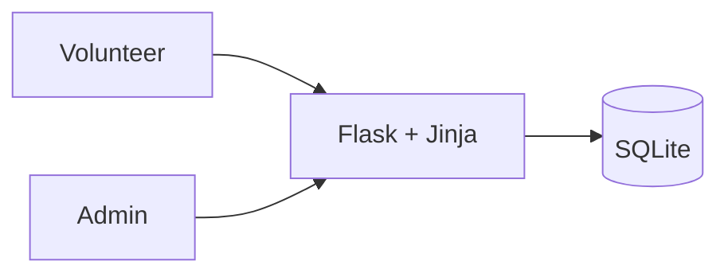

# Volunteer Shift Scheduler

I built a small app that lets an organisation create volunteer shifts and lets volunteers claim or cancel spots.

---

## Quickstart (how I run it locally)
```bash
python3 -m venv .venv && source .venv/bin/activate
pip install -r requirements.txt
python app.py
```
Then I open **http://127.0.0.1:5000** in my browser.

**Default admin (seeded):** `admin@example.com` / `admin123` *(I change this later.)*

---

## Features (MVP)
- Admin creates shifts (title, time window, location, capacity)
- Volunteers register / log in
- Home page lists upcoming shifts with **spots left**
- Volunteers can **sign up** (capacity guarded) and **cancel** from **/my**
- Simple UI with Jinja templates
- Tiny automated test + GitHub Actions (CI)

---

## Architecture


---

## Routes (current)
- `GET /` — list upcoming shifts
- `POST /shifts/<id>/signups` — sign up (login required)
- `GET /my` — see my signups (login required)
- `POST /signups/<id>/cancel` — cancel my signup (login required)
- `GET /admin/shifts/new` — admin form
- `POST /admin/shifts` — create shift (admin only)
- `GET /login` · `POST /login` · `GET /register` · `POST /register` · `GET /logout`

---

## Screenshots (for my report)
I store proof in `docs/screenshots/` and reference them here:
- 
- 
- 

*(If an image doesn’t show yet, I add it later.)*

---

## Version Control Evidence (what I used)
- **Issues** with labels; grouped under **Milestone `v1.0`**
- **Project board** (To do / In progress / Done)
- Work on **feature branches** → **Pull Requests** → **Merged** into `main`
- **GitHub Actions** runs on each PR (green)
- **GitHub Pages** (this site)
- **Release** `v1.0` with notes

---

## Links
- Repo: https://github.com/<your-username>/shift-scheduler
- Issues: https://github.com/<your-username>/shift-scheduler/issues
- Project Board: <paste your board URL>
- Milestone: https://github.com/<your-username>/shift-scheduler/milestones
- Actions: https://github.com/<your-username>/shift-scheduler/actions
- Latest Release: https://github.com/<your-username>/shift-scheduler/releases

---

## Security notes (MVP)
- Passwords are **hashed** (Werkzeug)
- Session-based auth (no secrets in repo)
- For a full version I’d add CSRF protection, input validation hardening, and rate limiting

---

## v1.0 summary
- List shifts, register/login, sign up with capacity guard, cancel, admin create shift
- One smoke test and CI
- This page published via **GitHub Pages** from `/docs`
